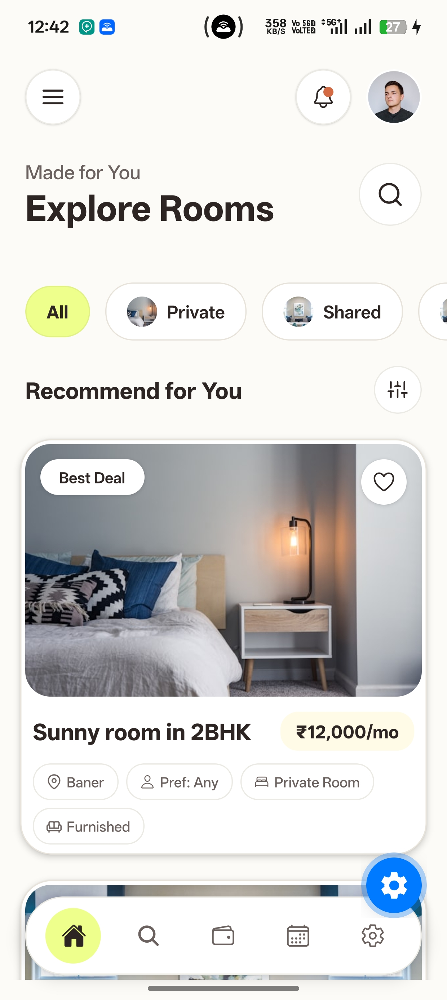
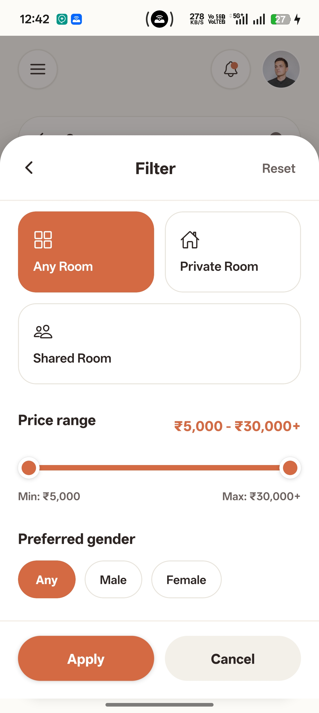
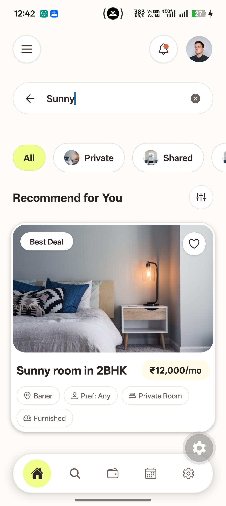
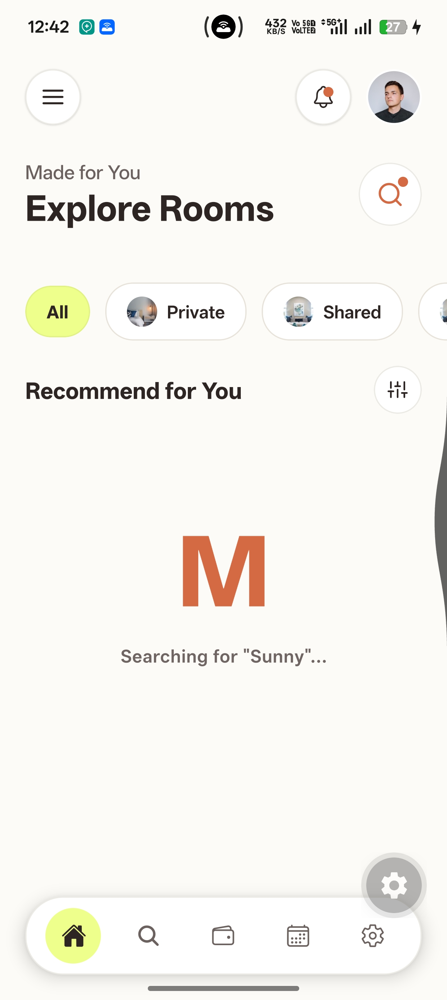

# MOKOGO Room Finder App

A high-fidelity, performance-optimized, and visually stunning React Native (Expo) prototype designed around the **MOKOGO Warm Hearth** brand guidelines. Features modular list components, dynamic filtering sheets, animated text search expansions, custom liquid-filling loaders, and fluid navigation tab indicators.

🔗 **GitHub Repository:** [https://github.com/avi4803/mokogo-app](https://github.com/avi4803/mokogo-app)

---

## 📸 Screenshots & Screen Recording

Here is the visual representation of the implemented high-fidelity prototype (including the dynamic feed card details, animated search bar, liquid-filling logo loader, and price range selector sheets):

### App Feed & Filters Modal
<div align="center">
  
  
  
  
</div>

### 🎥 Screen Recording Demo
<div align="center">
  <!-- Option 1: HTML5 video tag (For MP4/MOV files placed in assets folder) -->
  <video src="./assets/record.mp4" width="300" controls muted autoplay loop></video>
  
  <!-- Option 2: Animated GIF (Uncomment below if using GIF format) -->
  <!--  -->
</div>

---

## 🚀 How to Run the Application

Follow these steps to set up and run the project locally:

### 1. Prerequisites
Make sure you have Node.js and Git installed.

### 2. Clone the Repository
```bash
git clone https://github.com/avi4803/mokogo-app.git
cd mokogo-app
```

### 3. Install Dependencies
Install all required node packages and native configuration plugins using Expo's versioning cli:
```bash
npm install
```

### 4. Start the Application
Boot the Expo development server:
```bash
npx expo start
```

### 5. Running on Devices
- **Expo Go (Physical Device):** Scan the QR code displayed in the terminal using the Camera app (iOS) or Expo Go app (Android).
- **iOS Simulator:** Press `i` in the terminal (requires Xcode).
- **Android Emulator:** Press `a` in the terminal (requires Android Studio).
- **Clear Cache (If needed):** If you encounter dependency caching conflicts, run:
  ```bash
  npx expo start --clear
  ```

---

## 🛠️ Performance & Architectural Improvements

To transition the prototype toward commercial production standards, the following improvements were implemented:

1. **Virtualized List Performance:** Migrated listings rendering away from standard `ScrollView.map` arrays to a native `FlatList` component. Eliminated nested scroll view warnings by nesting layout headers directly inside `ListHeaderComponent`. Tuned windowing parameters (`initialNumToRender={4}`, `maxToRenderPerBatch={6}`, `windowSize={5}`) to guarantee smooth 60 FPS scrolling.
2. **Component Memoization:** Wrapped listing card elements in `React.memo` using custom props equality check (`isFavorite` and `listing.id` updates) to skip duplicate rendering sweeps. Memoized list event handlers (`handleToggleFavorite`, `handleResetFilters`) in `App.tsx` using `useCallback` hooks.
3. **Optimized Image Caching:** Replaced core React Native `<Image>` tags with the high-performance native **`expo-image`** library, enabling automated disk/memory cache allocation and soft `200ms` fade-in network load transitions.
4. **Clean Separation of Concerns:** Decoupled the root `App.tsx` file (reducing it from 530+ lines to under 130 lines) by extracting business logic to a custom hook (`src/hooks/useListings.ts`) and layouts into separate screen modules (`src/screens/HomeScreen.tsx`, `src/screens/PlaceholderScreen.tsx`).
5. **Modern Safe Areas:** Upgraded the container layout to use `react-native-safe-area-context` to automatically manage device notches, dynamic status bars, and hardware chin offsets across both platforms.
6. **Fluid Bottom Navigation Indicator:** Embedded a spring-based circular sliding indicator behind tab bar icons. Uses `Animated.spring` running directly on the native UI thread (`useNativeDriver: true`) to animate transition offsets dynamically based on screen layout width measurements.

---

## ⚖️ Technical Tradeoffs & Choices

- **State-Based Switching instead of Navigation Library:** Since the current scope is a high-fidelity feed prototype and does not require complex routing backstacks, deep linking hooks, or multi-screen parameters, we chose a React state-based switcher (`activeTab`) to avoid adding navigation dependencies until they are needed.
- **Local Custom Hook instead of Redux/Zustand:** To keep initial loading speeds high and code bundles light, listings state is isolated in a custom hook. As requirements expand (e.g. sharing favorites state across tab routes), state should be migrated to a global store like Zustand.
- **Simulated Fetch Delay:** Added a debounced `1000ms` loading delay on category select changes and search terms. This is intended as a UX demonstration of the custom liquid-filling "M" loader component before wiring actual API fetch calls.

---

## 🔮 What We Would Improve with More Time

- **Remote API Synchronization:** Integrate Axios/react-query clients connected to a live Node.js/PostgreSQL backend service.
- **Zustand State Store:** Migrate active states to a Zustand store to handle configuration data sharing across all screen sub-routes.
- **Full Gesture-Driven Sheets:** Re-architect the custom price range slider and filter modal using `react-native-reanimated` and `react-native-gesture-handler` to guarantee physics-based animations that run entirely on the UI thread under high CPU loads.
- **Global Error Boundaries:** Wrap component cards in React boundaries reporting failures to crash reporting suites (like Sentry).
